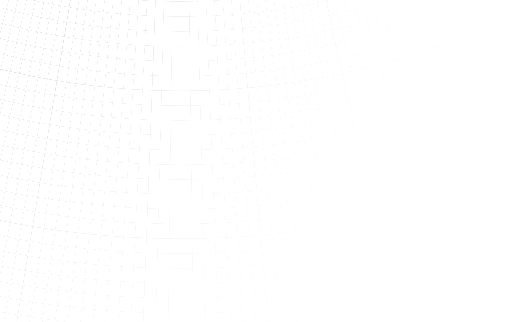

```{r setup, global_options,include=FALSE}
knitr::opts_chunk$set(
  dpi = 200,
  strip.white = T,
  message = FALSE,
  comment = NA,
  echo = FALSE,
  warning = FALSE,
  eval = TRUE
  
)
```

```{r include=FALSE}
source('./assets/functions.R')

requiredPackages = c('knitr','png','grid','gridExtra',"tmap","ggplot2",
                     'RColorBrewer',"dplyr","kableExtra","dotenv","ade4")

PackageFacile(requiredPackages)

load_dot_env(".env")
annee = Sys.getenv("annee")

```


class: center, middle, inverse, title-slide, animated, fadeIn
# Cartographie M2 IGAST `r annee`
# Sémiologie graphique et discrétisation<br /> <br />
### Florian Bayer

<div class="my-footer"><span>ENSG - M2 IGAST `r annee` : cartographie - Florian Bayer</span></div> 

---
class: animated, fadeIn
## Objectifs du cours

**A la fin de ce cours, vous serez capables de :**
- Comprendre les principes fondamentaux de la cartographie et de la sémiologie graphique.
- Identifier les différents types de données et leurs propriétés. 
- Choisir les variables visuelles adaptées aux types de données et à l'objectif de la carte. 
- Appliquer les règles de la sémiologie graphique pour créer des cartes thématiques efficaces et lisibles. 
- Être conscients de la subjectivité inhérente à la cartographie et s'efforcer de produire des cartes objectives. 

<div class="my-footer"><span>ENSG - M2 IGAST `r annee` : cartographie - Florian Bayer</span></div> 

---
class: animated, fadeIn
## Les principes de la cartographie

La carte n’est pas un dessin. Elle est l’outil le mieux adapté pour communiquer des informations spatiales à condition qu’elle soit efficace.
Elle permet de traduire graphiquement un texte ou des séries de chiffres pour faciliter la compréhension d’un **message**. Et ceci le plus rapidement

Ce message doit :

- Être clair et efficace
- Demander un minimum de temps de compréhension et d’analyse pour le lecteur
- Apparaître dans un premier temps au niveau de l’ensemble de la carte, puis dans le détail

Dans le cas contraire, le lecteur ne prêtera pas attention à la carte

<div class="my-footer"><span>ENSG - M2 IGAST `r annee` : cartographie - Florian Bayer</span></div> 

---
class: animated, fadeIn
## Pourquoi des règles de production cartographique ?

.pull-left[ .center-img[
```{r echo=FALSE, out.width="100%"}
knitr::include_graphics("https://i.imgur.com/hzRdutm.png")
```
]]
.pull-right[ .center-img[
```{r echo=FALSE, out.width="100%"}
knitr::include_graphics("https://i.imgur.com/Jbt3JUW.png")
```
]]

<div class="my-footer"><span>ENSG - M2 IGAST `r annee` : cartographie - Florian Bayer</span></div> 

---
class: animated, fadeIn
## Principes de la cartographie

Pour **communiquer** avec la carte, on utilise le **langage graphique** (*i.e communiquer par l'image*) 

Comme tous les langages, on trouve :


>- un alphabet
>- un vocabulaire
>- une syntaxe

qui sont autant de règles de construction et d’utilisation.

<div class="my-footer"><span>ENSG - M2 IGAST `r annee` : cartographie - Florian Bayer</span></div> 

---

class: animated, fadeIn
## Le langage cartographique

- alphabet

.center-img[
```{r echo=FALSE, out.width="40%"}
knitr::include_graphics("https://i.imgur.com/63kuDKc.png")
```
]

___ 

- vocabulaire

.center-img[
```{r echo=FALSE, out.width="70%"}
knitr::include_graphics("https://i.imgur.com/0XbABMN.png")
```
]

___

- syntaxe (sémiologie graphique)

.center-img[
```{r echo=FALSE, out.width="50%"}
knitr::include_graphics("https://i.imgur.com/h8UbI1G.gif")
```
]

---
class: animated, fadeIn
## Le langage cartographique

Ces règles sont basées sur la manière dont le lecteur perçoit au mieux la transcription graphique de données dites **quantitatives** et **qualitatives**. 

- Il s’agit de règles **optimales** de transmission de messages, basée sur des propriétés **physiologiques**.  
- La sémiologie graphique a été développée par Jacques Bertin (*Sémiologie Graphique. Les diagrammes, les réseaux, les cartes 1967*)
- La bonne utilisation de ces règles est **indispensable** afin d’avoir un message cartographique **clair et objectif**

<div class="my-footer"><span>ENSG - M2 IGAST `r annee` : cartographie - Florian Bayer</span></div> 


---
class: animated, fadeIn
## Le langage cartographique

Il faut toujours avoir conscience des points suivants avant de vous lancer dans la production d'une carte  :
- La carte n’est pas faite pour son auteur mais pour ses **lecteurs**
- Il faut **adapter son message** aux types de lecteurs et au support de la carte
- La carte doit être **simple et efficace** au niveau du rendu (pas dans sa conception). 
- Le lecteur doit fournir un **minimum d’effort** pour comprendre la carte dès le premier coups d’œil
- Les cartes sont un ensemble de petits mensonges communément acceptés (pour simplifier la compréhension du message)
- La carte est un outil de **communication très puissant**. Son utilisation doit se faire de manière **honnête et objective**

<div class="my-footer"><span>ENSG - M2 IGAST `r annee` : cartographie - Florian Bayer</span></div> 


---
class: animated, fadeIn
## Subjectivité de la carte 

En tant que **scientifique**, vous devez vous efforcer d’être le plus **objectif possible** lors de la création d’une carte ou d’un graphique.   
Pour cela **d’outils et de règles** qu’il faut respecter pour garantir à la fois la bonne transmission du message et son objectivité.   

<div class="my-footer"><span>ENSG - M2 IGAST `r annee` : cartographie - Florian Bayer</span></div> 

---
class: animated, fadeIn
## Objectivité

Deux cartes « identiques » mais avec des messages différents :    

<div style="display:table-cell; vertical-align:middle; horizontal-align:center">

.pull-left[

L’opposition au prélèvement d’organe **n’est pas un problème** en France :
```{r echo=FALSE, out.width="100%"}
knitr::include_graphics("https://i.imgur.com/LW3AQz1.png")
```
]

.pull-right[
L’opposition au prélèvement d’organe **est un problème** en France :
```{r echo=FALSE, out.width="100%"}
knitr::include_graphics("https://i.imgur.com/MhYCkag.png")
```
] </div>

<div class="my-footer"><span>ENSG - M2 IGAST `r annee` : cartographie - Florian Bayer</span></div> 

---
class: animated, fadeIn
## Objectif

<div class="my-footer"><span>ENSG - M2 IGAST `r annee` : cartographie - Florian Bayer</span></div> 

1. Identifier l’objectif de votre carte, réfléchir à la problématique :
   * Dois je faire une carte pour y répondre ?
   * Dans quel contexte ? (exploratoire, synthèse, illustration)   

2. Identifier votre public :
   * Des experts sur le sujet ? Des novices ?


3. Identifier le support :
   * Papier ? Ecran ? 
   * Couleur ? Noir et blanc ?

**Ensuite et seulement ensuite**, vous pouvez identifier les informations à utiliser


---
class: animated, fadeIn
## Public

Carte des climats - 6ème (source inconnue)
.center-img[
```{r echo=FALSE, out.width="70%"}
knitr::include_graphics("https://i.imgur.com/PPmKMgf.png")
```
]

<div class="my-footer"><span>ENSG - M2 IGAST `r annee` : cartographie - Florian Bayer</span></div> 


---
class: animated, fadeIn
## Public

Carte des climats - Larousse
.center-img[
```{r echo=FALSE, out.width="80%"}
knitr::include_graphics("https://i.imgur.com/r2VoUKi.png")
```
]

<div class="my-footer"><span>ENSG - M2 IGAST `r annee` : cartographie - Florian Bayer</span></div> 


---
class: animated, fadeIn
## Public

Carte des climats - Köppen 
.center-img[
```{r echo=FALSE, out.width="80%"}
knitr::include_graphics("https://i.imgur.com/whvzcVN.png")
```
]

<div class="my-footer"><span>ENSG - M2 IGAST `r annee` : cartographie - Florian Bayer</span></div> 

---
class: animated, fadeIn
## Support...

.center-img[
```{r echo=FALSE, out.width="80%"}
knitr::include_graphics("https://i.imgur.com/Wcp0wh8.png")
```
]

<div class="my-footer"><span>ENSG - M2 IGAST `r annee` : cartographie - Florian Bayer</span></div> 


---
class: animated, fadeIn
## Transmission efficace de l’information

Tout comme les règles de la sémiologie graphique et l’adaptation du contenu au lecteur, la mise en page cartographique est un élément majeur permettant de **garantir la bonne transmission du message cartographique**.

Ce message doit : 

1. Être clair et efficace.
2. Demander un minimum de temps de compréhension et d’analyse pour le lecteur.
3. Apparaître au niveau de l’ensemble de la carte et non pas dans le détail.

Dans le cas contraire, le lecteur ne prêtera pas attention à la carte.

Une mise en page réussie permet de garantir la bonne transmission du message cartographique.

Mais maîtriser un SIG ou un logiciel comme Inkscape ne fait pas de vous un expert en mise en page… Ce ne sont que des outils pour vous aider.

<div class="my-footer"><span>ENSG - M2 IGAST `r annee` : cartographie - Florian Bayer</span></div> 

---

class: inverse, center, middle, animated, fadeIn  
# 2- Rappels : les différents types de données

<div class="my-footer-title "></div> 

---

class: animated, fadeIn
## L’information géographique
<div class="my-footer"><span>ENSG - M2 IGAST `r annee` : cartographie - Florian Bayer</span></div> 

Le géographe a pour particularité de s’intéresser aux **lieux** auxquels sont rattachés les données.
- Une information non localisable a donc peu d’intérêt pour le géographe

Le cartographe utilise donc de l’**information géographique**, c’est-à-dire localisable dans l’espace : 
- Par des coordonnées 
- Par une appartenance à un lieu, à un maillage	

Ces appartenances ont un intérêt si elles peuvent être **caractériser** :
- À une commune peut être associée sa population totale ou sa densité 

Si la collecte de l’information géographique peut parfois être laborieuse, son analyse peut se faire avec les mêmes outils qu’en statistique. 


---
class: animated, fadeIn
## Les données en cartographie

<div class="my-footer"><span>ENSG - M2 IGAST `r annee` : cartographie - Florian Bayer</span></div> 

Les données utilisées en cartographie et statistique proviennent de multiples sources (*recensement, sondage,images satellites etc.*) et peuvent être **caractérisées**  :

.center-img[.pull-left[
Données qualitatives
```{r echo=FALSE, out.width="90%"}
knitr::include_graphics("https://i.imgur.com/LURhogM.png")
```
]

.pull-right[
Données quantitatives
```{r echo=FALSE, out.width="70%"}
knitr::include_graphics("https://i.imgur.com/23wnBvB.png")
```
]]


---
class: animated, fadeIn
## Données quantitatives et qualitatives
On peut caractériser les données en deux grands types, eux-mêmes disposant de sous-caractéristiques. 

<div class="my-footer"><span>ENSG - M2 IGAST `r annee` : cartographie - Florian Bayer</span></div> 

.pull-left[
Les données **qualitatives** :
caractérise la nature de ce qui est décrit et non la quantité. 
- Un nom
- Une couleur
- Le type de sol
]

.pull-right[
Les données  **quantitatives** :
Caractérise une quantité, par définition mesurable
- Une population 
- Un taux de chômage
- Une densité
- L'IDH
]

---
class: animated, fadeIn
## Quantitatives et qualitatives ?
<div class="my-footer"><span>ENSG - M2 IGAST `r annee` : cartographie - Florian Bayer</span></div> 

Il est important de pouvoir justifier le type de données :

.pull-left[
- Si la moyenne est impossible ou absurde : qualitatif (code départementaux, numéro de téléphone)
- Si la moyenne a un sens : quantitatif (population, température)
]

.center-img[
.pull-right[
```{r echo=FALSE, out.width="100%"}
knitr::include_graphics("https://i.imgur.com/E5PQNoK.png")
```
]]

---
class: animated, fadeIn
## Les sous types de données qualitatives
<div class="my-footer"><span>ENSG - M2 IGAST `r annee` : cartographie - Florian Bayer</span></div> 

Les données qualitatives peuvent avoir d'autres propriétés, importantes en cartographie et en statistique

.pull-left[
Qualitatif **nominal** : contient une notion de différence, aucun ordre
- Codes départementaux
- Des prénoms
- Des numéros étudiants
*v.s.*

Qualitatif **ordinal**: contient une notion d'ordre sans être mesurable
- Une classification : grand > moyen > petit
]

.pull-right[
Qualitatif **discret** : il y a moins de modalités que d'éléments. 
- Le statut des hôpitaux : CHU, CHR, CH (3 statuts, 6 000 hôpitaux)
- Le statut des communes : Capitale, préfecture, sous préfecture

*v.s.*

Qualitatif **exhaustif** : il y a autant de modalités que d'éléments
- Le nom des pays, des régions
- Un code
]

---
class: animated, fadeIn
## Les sous types de données quantitatives
<div class="my-footer"><span>ENSG - M2 IGAST `r annee` : cartographie - Florian Bayer</span></div> 

Les données **quantitatives** peuvent aussi avoir d'autres propriétés, toutes aussi importantes en cartographie et en statistique

.pull-left[
Quantitatif de **stock** : une quantité brute, un effectif. 
- La population
- Une production en tonne

*v.s*

Quantitatif de **taux** : un rapport, un indice. 
- La densité de population
- Le taux de chômage
- L'IDH
]

---
class: animated, fadeIn
## Stock ou taux ?
<div class="my-footer"><span>ENSG - M2 IGAST `r annee` : cartographie - Florian Bayer</span></div> 

.pull-left[
Comment faire la différence entre stock et taux ? 
- Si la somme a une signification : stock (la somme de la population des pays du monde = la population mondiale)
- Si la somme n'a pas de sens : taux (la somme du taux de chômage des pays du monde ne correspond pas au taux de chômage mondial)

Attention, ce n’est pas parce que la valeur contient une virgule qu’il s’agit d’une données de taux :
- la France à une population de 66,6 millions d’habitants en 2016
]

.center-img[
.pull-right[
```{r echo=FALSE, out.width="100%"}
knitr::include_graphics("https://i.imgur.com/feMB7iW.png")
```
]]


---
class: animated, fadeIn
## Les sous types de données quantitatives
<div class="my-footer"><span>ENSG - M2 IGAST `r annee` : cartographie - Florian Bayer</span></div> 

.pull-left[
Quantitatif **repérable** : le zéro est conventionnel
- L'altitude

*v.s.*

Quantitatif **mesurable**: le zéro signifie l'absence concrète
- Le taux de chômage
- La population
]

.pull-right[
Quantitatif **discret** : une variable discrète a un nombre fini ou dénombrable (qu’on peut compter) de valeurs possibles. Elles sont distinctes et séparées, aucune valeur intermédiaire n’est possible : 
- Le nombre d’étudiants dans cette salle de cours à ce moment de la journée
- Les pointures de chaussures

*v.s.*

Quantitatif **continu**: il y a un nombre illimité de valeurs (non dénombrables). Entre deux valeurs distinctes, il y a toujours une valeur intermédiaire possible : 
- Le taux de chômage 
- La vitesse du vent
]

On peut transformer une donnée continue en donnée discrète en classant les valeurs dans des classes $\Rightarrow$ discrétisation

---
class: animated, fadeIn
## En résumé

.center-img[
```{r echo=FALSE, out.width="90%"}
knitr::include_graphics("https://i.imgur.com/5bzqWYD.png")
```
]

<div class="my-footer"><span>ENSG - M2 IGAST `r annee` : cartographie - Florian Bayer</span></div> 


---
class: inverse, center, middle, animated, fadeIn  
# 3- La sémiologie graphique

<div class="my-footer-title "></div> 

---
class: animated, fadeIn
## Principes
<div class="my-footer"><span>ENSG - M2 IGAST `r annee` : cartographie - Florian Bayer</span></div> 

En cartographie, on cherche à faire varier des figurés pour transmettre une information : les variables visuelles

Il s’agit des moyens graphiques pour représenter l’information. 
>- Elles forment le vocabulaire du langage graphique. 
>- Elles traduisent visuellement un texte ou une série de données.

.center-img[
```{r echo=FALSE, out.width="100%"}
knitr::include_graphics("https://i.imgur.com/LFuvZoc.png")
```
]

---
class: animated, fadeIn
## Principes
<div class="my-footer"><span>ENSG - M2 IGAST `r annee` : cartographie - Florian Bayer</span></div> 


.pull-left1[
Il en existe 4 principales (physiologiques) 
>- La valeur
>- La forme
>- La taille
>- La couleur

Et 3 secondaires (construites)
>- La texture
>- L’orientation
>- Le grain/la graisse

]

.center-img[.pull-right3[
```{r echo=FALSE, out.width="100%"}
knitr::include_graphics("https://i.imgur.com/B6JlFNt.png")
```
]]

---
class: animated, fadeIn
## Principes
<div class="my-footer"><span>ENSG - M2 IGAST `r annee` : cartographie - Florian Bayer</span></div> 

Toutes ont des **propriétés** et ne transmettent pas la même information. On dit que les variables visuelles offrent des possibilités de **différentiation visuelle** :

.center-img[
```{r echo=FALSE, out.width="100%"}
knitr::include_graphics("https://i.imgur.com/3GGsKKQ.png")
```
]

C'est pour cela qu'elles sont **dépendantes du type de données** en amont.

---
class: animated, fadeIn
## Autres propriétés

Les variables visuelles ont toutes une **longueur** spécifique :
- le nombre de variations possibles que le lecteur est capable de percevoir. 
- La longueur d'une varibale visuelle dépend aussi de l'implantation (plus grande en implantation zonale que ponctuelle ou linéaire).

De plus, il est possible de **combiner** plusieurs variables visuelles pour renforcer le message ou transmettre deux informations.

<div class="my-footer"><span>ENSG - M2 IGAST `r annee` : cartographie - Florian Bayer</span></div> 


---
class: inverse, center, middle, animated, fadeIn
# La couleur


<div class="my-footer-title "></div> 

---
class: animated, fadeIn
## La couleur : définition

La couleur est composée de 3 éléments: 
- La teinte (nuance/ton) : l’interprétation par l’œil de l’ensemble des radiations renvoyées par un objet éclairé en lumière blanche. C’est la forme pure d’une couleur, sans ajout de blanc ou de noir
- L’intensité (valeur) : l’intensité lumineuse de la couleur (clair au sombre)
- La saturation (pureté de la couleur) : la « vivacité » de la couleur. Plus elle est saturée, plus elle tend vers le gris 

.center-img[
```{r echo=FALSE, out.width="80%"}
knitr::include_graphics("https://i.imgur.com/WyuQMzn.png")
```
]


<div class="my-footer"><span>ENSG - M2 IGAST `r annee` : cartographie - Florian Bayer</span></div> 

---
class: animated, fadeIn
## La couleur : propriétés

**Propriétés**
- La couleur est **très sélective** et est facilement mémorisable par le lecteur 
- Elle est ordonnée **uniquement** de part et d’autre du spectre du visible (jaune = neutre) et seulement sur 2 couleurs (chaude – froide)

**Utilisation**
- Il s’agit de la meilleure manière de mettre en évidence divers natures d’objets
- Elle dépend toutefois des moyens d’impressions et d’édition 

**Longueur**
- 5 à 10 (très efficace en implantation zonale)

<div class="my-footer"><span>ENSG - M2 IGAST `r annee` : cartographie - Florian Bayer</span></div> 

---
class: animated, fadeIn
## La couleur : exemples

<div class="my-footer"><span>ENSG - M2 IGAST `r annee` : cartographie - Florian Bayer</span></div> 

.center-img[.pull-left[
```{r echo=FALSE, out.width="100%"}
knitr::include_graphics("https://i.imgur.com/RWLywEX.png")
```
]


.pull-right[
```{r echo=FALSE, out.width="100%"}
knitr::include_graphics("https://i.imgur.com/L9ivdmX.png")
```
]]


---
class: inverse, center, middle, animated, fadeIn
# La valeur


<div class="my-footer-title "></div> 

---
class: animated, fadeIn
## La valeur : définition

*"Le rapport entre la quantité de noir et de blanc perçues sur une surface données" (J. Bertin)*
- Elle peut être en applat, du blanc vers le noir en passant par une infinité de gris
- Elle peut aussi prendre la forme d'une trame où les quantités de blanc et de noir évoluent à l'inverse

.center-img[
```{r echo=FALSE, out.width="70%"}
knitr::include_graphics("https://i.imgur.com/15qKghS.png")
```
]


<div class="my-footer"><span>ENSG - M2 IGAST `r annee` : cartographie - Florian Bayer</span></div> 

---
class: animated, fadeIn
## La valeur : propriétés

**Propriétés**
- La valeur traduit avant tout une notion d'**ordre**

**Utilisation**
- Pour les données **quantitatives de taux** (il faut discrétiser la série statistique)
- Mais aussi pour les données **qualitatives ordinales**

**Longueur**
- Implantation zonale : 8 à 9 paliers
- Implantation ponctuelle et linéaire : 4 à 5 paliers


<div class="my-footer"><span>ENSG - M2 IGAST `r annee` : cartographie - Florian Bayer</span></div> 

---
class: animated, fadeIn
## La valeur : remarque 

Il est possible de combiner la valeur à UNE couleur : un **camaïeu**
- On passera toujours par des niveaux de gris, mais combiné avec une teinte
- Pour cela, il faut jouer sur la saturation de la couleur, en **gardant le même ton.**

.center-img[
```{r echo=FALSE, out.width="70%"}
knitr::include_graphics("https://i.imgur.com/efMjOHa.png")
```
]

Il est également possible de réaliser une **gradation harmonique** dans les tons chauds (jaune vers le rouge) ou les tons froids (moins pertinent). Il faut alors jouer sur la valeur (plus faible pour le jaune, plus foncé pour le rouge)

.center-img[
```{r echo=FALSE, out.width="90%"}
knitr::include_graphics("https://i.imgur.com/kMcoDtu.png")
```
]


<div class="my-footer"><span>ENSG - M2 IGAST `r annee` : cartographie - Florian Bayer</span></div> 

---
class: animated, fadeIn
## La valeur : remarque 3

Il est possible de réaliser une *double progression de valeur* de part et d’autre d’un centre : une **montée de valeur en double progression inversée**. 

- La classe centrale aura une couleur neutre : blanc cassé, jaune pâle. Il faut éviter les oppositions bleu/rouge
- Uniquement pour des valeurs avec oppositions (inférieur et supérieur à 0)

.center-img[
```{r echo=FALSE, out.width="70%"}
knitr::include_graphics("https://i.imgur.com/1PGPpKU.png")
```
]

<div class="my-footer"><span>ENSG - M2 IGAST `r annee` : cartographie - Florian Bayer</span></div> 

---
class: animated, fadeIn
## La valeur : exemples

<div class="my-footer"><span>ENSG - M2 IGAST `r annee` : cartographie - Florian Bayer</span></div> 

.center-img[.pull-left[
```{r echo=FALSE, out.width="100%"}
knitr::include_graphics("https://i.imgur.com/KHIWHo9.png")
```
]

.pull-right[
```{r echo=FALSE, out.width="100%"}
knitr::include_graphics("https://i.imgur.com/Rj8eiXI.png")
```
]]

---
class: animated, fadeIn
## La valeur : exemples

<div class="my-footer"><span>ENSG - M2 IGAST `r annee` : cartographie - Florian Bayer</span></div> 

.center-img[.pull-left[
```{r echo=FALSE, out.width="80%"}
knitr::include_graphics("https://i.imgur.com/AXCL9D4.png")
```
]

.pull-right[
```{r echo=FALSE, out.width="100%"}
knitr::include_graphics("https://i.imgur.com/rkqDIEL.png")
```
]]


---
class: inverse, center, middle, animated, fadeIn
# La taille


<div class="my-footer-title "></div> 

---
class: animated, fadeIn
## La taille : définition

La variation proportionnelle de la surface, de la hauteur ou de la longueur d’un figuré

- La taille doit se combiner à une forme (simple de préférence).
- Pour les données de stock, la variation de la superficie de la forme **doit être proportionnelle** à la valeur de la donnée à représenter. L’objectif est de traduire la propriété de cumul des effectifs des variables de stock.
- Pour les données de stock : l’utilisateur doit être capable de recalculer les données exactes à partir de la carte.

.center-img[
```{r echo=FALSE, out.width="80%"}
knitr::include_graphics("https://i.imgur.com/9MAemGy.png")
```
]


<div class="my-footer"><span>ENSG - M2 IGAST `r annee` : cartographie - Florian Bayer</span></div> 

---
class: animated, fadeIn
## La taille : propriétés

**Propriétés et utilisation**

- Pour les données de **stock**, c'est la seule variabe traduisant une notion de **proportionnalité** (une valeur de 100 a une superficie deux fois plus importante qu'un cercle de valeur 50)
- Pour les données qualitatives ordinales, elle peut également traduire une notion d'**ordre** (petit, moyen, grand)

**Longueur**
- Théoriquement infinie, mais limité par le plus petit point visible par l’œil (0,2mm) et la place disponible sur la carte (sans gêner la lecture).

<div class="my-footer"><span>ENSG - M2 IGAST `r annee` : cartographie - Florian Bayer</span></div> 

---
class: animated, fadeIn
## La taille : remarque 

Pourquoi utiliser la valeur uniquement sur les variables de taux ?

- Les variations de taille sont facilement perçues par l’œil et sont immédiatement identifiées comme des rapports de proportionnalités entre des effectifs. 
- Cette variable est la seule qui traduise **efficacement une quantité.**

.center-img[.pull-left[
```{r echo=FALSE, out.width="70%"}
knitr::include_graphics("https://i.imgur.com/XlEl9wc.png")
```

Le lecteur perçoit immédiatement les rapports de proportionnalité et d’ordre.
Un ou deux allers et retours avec la légende suffisent à assimiler précisément l’information statistique.

]


.pull-right[
```{r echo=FALSE, out.width="70%"}
knitr::include_graphics("https://i.imgur.com/gbv8tuP.png")
```

Le lecteur perçoit uniquement le rapport d’ordre.
De nombreux aller-retour avec la légende sont nécessaires pour assimiler une information moins détaillés (discrétisée).

]]

<div class="my-footer"><span>ENSG - M2 IGAST `r annee` : cartographie - Florian Bayer</span></div> 

---
class: animated, fadeIn
## La taille : exemples

<div class="my-footer"><span>ENSG - M2 IGAST `r annee` : cartographie - Florian Bayer</span></div> 

.center-img[.pull-left[
```{r echo=FALSE, out.width="100%"}
knitr::include_graphics("https://i.imgur.com/5y5ftH8.png")
```
]

.pull-right[
```{r echo=FALSE, out.width="100%"}
knitr::include_graphics("https://i.imgur.com/4PMulLL.png")
```
]]

---
class: animated, fadeIn
## La taille : exemples

<div class="my-footer"><span>ENSG - M2 IGAST `r annee` : cartographie - Florian Bayer</span></div> 

.center-img[.pull-left[
```{r echo=FALSE, out.width="80%"}
knitr::include_graphics("https://i.imgur.com/HhrzTTo.png")
```
]

.pull-right[
```{r echo=FALSE, out.width="80%"}
knitr::include_graphics("https://i.imgur.com/9HT2OqH.png")
```
]]


---
class: inverse, center, middle, animated, fadeIn
# La forme


<div class="my-footer-title "></div> 

---
class: animated, fadeIn
## La forme : définition

La variation des contours d'un figuré. Il peut s'agir de figurés : 
- géométriques (carré, cercle, triangle) 
- ou de pictogrammes (symbole)

Certains considère que la forme et la texture (voir définition suivante) sont la même variables, la seconde étant la forme en implantation zonale.

.center-img[
```{r echo=FALSE, out.width="100%"}
knitr::include_graphics("https://i.imgur.com/zGkf30M.png")
```
]

<div class="my-footer"><span>ENSG - M2 IGAST `r annee` : cartographie - Florian Bayer</span></div> 

---
class: animated, fadeIn
## La forme : propriétés

**Propriétés**

- Utilisée seule, la forme est très **sélective**
- Mais elle peut être facilement combinée avec d'autres variables visuelles :
  * Taille + Forme
  * Avec la couleur pour renforcer l'idée de différence

**Utilisation**

- Seule : pour les données de **qualitatives nominales**

**Longueur**
- Théoriquement infinie, mais 7 reste un maximum optimal


<div class="my-footer"><span>ENSG - M2 IGAST `r annee` : cartographie - Florian Bayer</span></div> 

---
class: animated, fadeIn
## La forme : remarques

<div class="my-footer"><span>ENSG - M2 IGAST `r annee` : cartographie - Florian Bayer</span></div> 

Il est conseillé d’utiliser des formes simples :

.center-img[
```{r echo=FALSE, out.width="40%"}
knitr::include_graphics("https://i.imgur.com/gR1QrSd.png")
```
]

--

Si les symboles sont petits, il ne faut pas mélanger des formes que l’œil risque de confondre :

.center-img[
```{r echo=FALSE, out.width="10%"}
knitr::include_graphics("https://i.imgur.com/JzqtTos.png")
```
]

Dans ce cas, il est préférable d’utiliser des formes de hauteur et largeur variable :

.center-img[
```{r echo=FALSE, out.width="8%"}
knitr::include_graphics("https://i.imgur.com/UoBHM6E.png")
```
]

L’utilisation des pictogrammes doit se faire avec modération et de manière adéquate : 

.center-img[
```{r echo=FALSE, out.width="100%"}
knitr::include_graphics("https://i.imgur.com/yRv5jZm.png")
```
]

---
class: animated, fadeIn
## La forme : exemples

<div class="my-footer"><span>ENSG - M2 IGAST `r annee` : cartographie - Florian Bayer</span></div> 

.center-img[.pull-left[
```{r echo=FALSE, out.width="100%"}
knitr::include_graphics("https://i.imgur.com/67kHF4O.png")
```
]

.pull-right[
```{r echo=FALSE, out.width="100%"}
knitr::include_graphics("https://i.imgur.com/pbdfSrb.png")
```
]]

---
class: inverse, center, middle, animated, fadeIn
# La texture - structure


<div class="my-footer-title "></div> 

---
class: animated, fadeIn
## La texture - structure : définition

La répétition d’un motif sur un figuré. Elle peut  être facilement combinée avec d’autres variables comme la couleur (couverture végétale)

.center-img[
```{r echo=FALSE, out.width="50%"}
knitr::include_graphics("https://i.imgur.com/D5UIiiZ.png")
```
]

<div class="my-footer"><span>ENSG - M2 IGAST `r annee` : cartographie - Florian Bayer</span></div> 

---
class: animated, fadeIn
## La texture - structure : propriétés

**Propriétés**

- Seule : est elle est **sélective**
- Combiné avec la valeur, elle est **ordonnée**
- La seule variable visuelle permettant de transmettre une information **qualitative en implantation zonale en noir et blanc**

**Utilisation** 

- Seule : pour des données **qualitatives nominales**. Dans ce cas, il faut veiller à garder le même rapport noir/blanc si on utilise plusieurs textures.
- Avec la valeur : pour des données **quantitatives de taux** ou **qualitatives ordinales**. Permet de faire facilement des montées de valeur manuelles et des doubles gammes inversées en noir et blanc

**Longueur**
- 4 à 5 paliers

<div class="my-footer"><span>ENSG - M2 IGAST `r annee` : cartographie - Florian Bayer</span></div> 

---
class: animated, fadeIn
## La texture - structure : exemples

<div class="my-footer"><span>ENSG - M2 IGAST `r annee` : cartographie - Florian Bayer</span></div> 

.center-img[.pull-left[
```{r echo=FALSE, out.width="100%"}
knitr::include_graphics("https://i.imgur.com/YLVSrvs.png")
```
]

.pull-right[
```{r echo=FALSE, out.width="100%"}
knitr::include_graphics("https://i.imgur.com/w6gDBvg.png")
```
]]

---
class: inverse, center, middle, animated, fadeIn
# noitatneiro'L


<div class="my-footer-title "></div> 

---
class: animated, fadeIn
## L'orientation : définition

La variation de l’angle d’une forme ou d’une texture par rapport à un axe


.center-img[
```{r echo=FALSE, out.width="50%"}
knitr::include_graphics("https://i.imgur.com/EusHTqF.png")
```
]

<div class="my-footer"><span>ENSG - M2 IGAST `r annee` : cartographie - Florian Bayer</span></div> 

---
class: animated, fadeIn
## L'orientation : propriétés

**Propriétés**

- Elle est **sélective**, mais doit être combiné avec la forme ou la texture

**Utilisation**

- Pour des données **qualitatives nominales**.
- Il faut éviter les traits verticaux (vibrations) et utiliser des variations d’angles de 45°

**Longueur**	
- 4 paliers

<div class="my-footer"><span>ENSG - M2 IGAST `r annee` : cartographie - Florian Bayer</span></div> 


---
class: inverse, center, middle, animated, fadeIn
# Le grain


<div class="my-footer-title "></div> 

---
class: animated, fadeIn
## Le grain / la graisse : définition

L’agrandissement ou la réduction d’une texture, **sans changer** le rapport entre le noir et le blanc 

.center-img[
```{r echo=FALSE, out.width="50%"}
knitr::include_graphics("https://i.imgur.com/8lqO5V6.png")
```
]

<div class="my-footer"><span>ENSG - M2 IGAST `r annee` : cartographie - Florian Bayer</span></div> 

---
class: animated, fadeIn
## Le grain / la graisse : propriétés

**Propriétés**

- Elle est **ordonnées**, mais doit être combiné avec la texture

**Utilisation** 

- Pour des données **qualitatives ordinales** ou **quantitatives de taux**.
- Pour transmettre une notion d’ordre, il faut aujourd'hui privilégier la variable valeur (aplat ou trame) plutôt que le grain 

**Longueur**
- 4 paliers, uniquement efficace en implantation zonale

<div class="my-footer"><span>ENSG - M2 IGAST `r annee` : cartographie - Florian Bayer</span></div> 

---
class: inverse, center, middle, animated, fadeIn  
# 4- La mise en page cartographique

<div class="my-footer-title "></div> 

---
class: animated, fadeIn
## La mise en page cartographique


**Principes clés:**

Une carte est un message visuel qui doit transmettre le plus rapidement une information au lecteur 

* La mise en page est essentielle pour une transmission efficace du message cartographique
* Un bon design cartographique facilite la lecture et la compréhension de l'information
* Maîtriser un SIG ou un logiciel de design ne garantit pas une mise en page réussie

**Objectifs d'une mise en page efficace :**

* **Clarté et efficacité :** Le message doit être facile à saisir 
* **Rapidité de compréhension :** Minimiser l'effort de lecture et d'analyse 
* **Vision d'ensemble et détails :** L'information doit être accessible à différentes échelles

La mise en page de la carte est, au même titre que la sémiologie graphique, un élément **majeur** de la production d’une carte. Elle permet de garantir la **bonne transmission** du message cartographique.

<div class="my-footer"><span>ENSG - M2 IGAST `r annee` : cartographie - Florian Bayer</span></div> 

---
class: animated, fadeIn
## La mise en page cartographique


La mise en page : 
- Doit aider le travail de lecture du public cible
- Doit être simple et efficace
- Doit permettre de minimiser le temps de lecture
- Ne doit pas ce faire en fonction du support mais de la carte
- Doit être "aérer" sans trop l’être…
- Doit permettre à la carte de ce suffire à elle même

Il **faut** qu’elle respecte le **principe du moindre effort** pour le LECTEUR (pas pour le cartographe)

<div class="my-footer"><span>ENSG - M2 IGAST `r annee` : cartographie - Florian Bayer</span></div> 

---
class: animated, fadeIn
## La mise en page cartographique

**Pour une carte complète et lisible, il est indispensable d'inclure :**

1. .font130[**Titre :** : Clair, concis et informatif sur le sujet de la carte]
2. **Titre de légende** : Donne des informations sur les indicateurs cartographiés
3. Données de la légende : Explique les symboles, couleurs et autres éléments visuels utilisés.
4. .font80[ Echelle / Auteur / *Source* / Date]


<div class="my-footer"><span>ENSG - M2 IGAST `r annee` : cartographie - Florian Bayer</span></div> 


---
class: animated, fadeIn
## Le titre
<div class="my-footer"><span>ENSG - M2 IGAST `r annee` : cartographie - Florian Bayer</span></div>  

.pull-left[
Première **lecture** du document, il doit donc:
- Etre simple, clair et visible 
- Informer le lecteur sur le message principal de la carte (général)
- Etre placé de préférence en haut de la carte (centre ou à gauche)
- Rien de technique ni signe mathématique
- Encadrer ou souligner le titre ne fait que surcharger la carte 
- Le mettre en majuscule permet de souligner le message (agressif en terme de communication)
- Pas plus de deux lignes pour un titre 
]

.pull-right[
```{r echo=FALSE, out.width="85%"}
knitr::include_graphics("https://i.imgur.com/172Yq2o.jpeg")
```
]


---
class: animated, fadeIn
## La légende
<div class="my-footer"><span>ENSG - M2 IGAST `r annee` : cartographie - Florian Bayer</span></div>  
.pull-left[

Elle doit informer **précisément sur la nature des données** cartographiées.
.font90[
- Elle est pensée en fonction du public
- Elle est hiérarchisée 
- Elle est exhaustive et fidèle à la carte
- Son titre est plus précis que celui de la carte. Il informe le lecteur sur la nature exacte des données (unités si quantitatif)
- La légende est placée de préférence en bas de la carte
- Ne pas spécifier : "légende" (surcharge inutile)
- Pour des données de stocks non discrétisées : 3 ou 4 figurés témoins (min, max et une ou deux valeurs intermédiaires)
- Pour des données de taux : pas de signe mathématique inutile, Si possible, faire des classes arrondies. Le minimum et le maximum sont visibles.
]]

.pull-right[
```{r echo=FALSE, out.width="100%"}
knitr::include_graphics("https://i.imgur.com/a7hz4jP.png")
```
]

---
class: animated, fadeIn
## L'échelle
<div class="my-footer"><span>ENSG - M2 IGAST `r annee` : cartographie - Florian Bayer</span></div>  

Le rapport entre une distance sur la carte et la distance réelle
- 1/25 000 :  1 cm sur la carte = 250 m dans la réalité (25  000 cm)
- Plus le dénominateur est élevé, plus la surface représentée est importante
- Petite échelle = grande surface représentée 1 / 1 000 000 (1cm  10 km)

.center-img[
```{r echo=FALSE, out.width="75%"}
knitr::include_graphics("https://i.imgur.com/zGdU8Ka.png")
```
]

L’échelle permet l’évaluation de l’espace étudié. Elle peut être graphique ou numérique. Il faut privilégier les échelles graphiques simples car elles sont faciles à lire et ne subissent pas les effets d’une réduction en cas de photocopie + réduction / agrandissement

.center-img[
```{r echo=FALSE, out.width="30%"}
knitr::include_graphics("https://i.imgur.com/jeZaI6R.png")
```
]

---
class: animated, fadeIn
## Les autres éléments obligatoires
<div class="my-footer"><span>ENSG - M2 IGAST `r annee` : cartographie - Florian Bayer</span></div>  

L’auteur (ou les auteurs)
- La ou les personnes qui ont réalisés la carte. 
- Si vous travaillez pour une entreprise, l’auteur sera parfois remplacé par le nom de l’entreprise. Toutefois, essayer toujours d’ajouter le votre…

La ou les sources
- Elle permet de préciser **l’origine** et la **date** des documents utilisées.
- Elle doit être discrète et en italique. 
- Elle permet de juger de la fiabilité du document.

Date
- La date de la conception des sources. 
- Si la date des chiffres est différente de la date des données, il faut l’indiquer (souvent dans le titre).

---
class: inverse, center, middle, animated, fadeIn  
# 2- Les éléments de la mise en page non obligatoires


<div class="my-footer-title "></div> 


---
class: animated, fadeIn
## Le cadre

<div class="my-footer"><span>ENSG - M2 IGAST `r annee` : cartographie - Florian Bayer</span></div>  

.pull-left[
Sa présence dépend de la mise en page et de l’aspect voulu. 
- Il permet parfois de mieux séparer la carte d’un texte (document Word),
- Sa présence est avant tout une question de gout, de surcharge et d’incrustation de la carte
- Un seul cadre est suffisant. Encadrer le titre + la carte + la légende ne fera que brouiller la lecture
- Créer un cadre permet cependant d’ajouter un léger fond à la carte :
]

.pull-right[
.center-img[
```{r echo=FALSE, out.width="60%"}
knitr::include_graphics("https://i.imgur.com/oa9VuRZ.png")
```
]]

---
class: animated, fadeIn
## L'orientation

<div class="my-footer"><span>ENSG - M2 IGAST `r annee` : cartographie - Florian Bayer</span></div>  

.pull-left[
Par convention, le nord correspond au haut de la carte.
- La flèche du Nord est donc inutile si c’est le cas
- Elle doit être ajoutée de façon discrète si ce n’est pas le cas ou pour lever une ambiguïté
]

.pull-right[
.center-img[
```{r echo=FALSE, out.width="100%"}
knitr::include_graphics("https://i.imgur.com/UhedeSr.jpeg")
```
]]


---

class: animated, fadeIn
## Principe

<div class="my-footer"><span>ENSG - M2 IGAST `r annee` : cartographie - Florian Bayer</span></div>  

La mise en page se fait en fonction de la carte et non de la place disponible sur la page. Il ne faut donc pas s’étaler sur la page en fonction de la place disponible mais orghaniser les éléments en fonction de la carte. 

On peut par exemple créer un cadre virtuel autours de la carte, qui augmente au fur et à mesure de l'ajout des éléments de la mise en page.
.center-img[
```{r echo=FALSE, out.width="100%"}
knitr::include_graphics("https://i.imgur.com/mUxeeEr.png")
```
]

---
class: inverse, center, middle, animated, fadeIn  
# Conclusions


<div class="my-footer-title "></div> 

---
class: animated, fadeIn
## Concepts clés
<div class="my-footer"><span>ENSG - M2 IGAST `r annee` : cartographie - Florian Bayer</span></div> 

La cartographie est un outil de communication basé sur la représentation visuelle d’un message par le **langage graphique**.

Comme tous les langages, il dispose d’un alphabet, d'un vocabulaire et d’une syntaxe qui doivent être respectés pour éviter les erreurs de communication : les **règles de la sémiologie graphique**.

**La sémiologie graphique** distingue 7 variables visuelles pour communiquer des notions :
* de différence (couleur, forme, texture, orientation)
* d'ordre (taille, valeur, grain)
* de proportionnalité (taille)

Ces variables visuelles dépendent des données en amont, qui transmettent les mêmes notions :
* qualitatives nominales : différence
* qualitatives ordinales et quantitatives de taux : ordre
* quantitatives de stock : proportionnalité

---
class: animated, fadeIn
## Concepts clés
<div class="my-footer"><span>ENSG - M2 IGAST `r annee` : cartographie - Florian Bayer</span></div> 

**La mise en page** est un élément clé du langage cartographique qui permet de :
* Organiser les éléments de la carte (titre, légende, échelle, etc.)
* Hiérarchiser l'information
* Faciliter la lecture et la compréhension

---
class: animated, fadeIn
## Concepts clés
<div class="my-footer"><span>ENSG - M2 IGAST `r annee` : cartographie - Florian Bayer</span></div> 

.center-img[
```{r echo=FALSE, out.width="100%"}
knitr::include_graphics("https://i.imgur.com/wBdiI03.png")
```
]

---
class: animated, fadeIn
## Concepts clés
<div class="my-footer"><span>ENSG - M2 IGAST `r annee` : cartographie - Florian Bayer</span></div> 

.center-img[
```{r echo=FALSE, out.width="100%"}
knitr::include_graphics("https://i.imgur.com/8pOhlmz.png")
```
]


---
class: animated, fadeIn
## Conclusion

* La cartographie est un outil puissant pour communiquer des informations spatiales.
* L'efficacité d'une carte dépend du choix judicieux des variables visuelles et d'une mise en page soignée.
* La sémiologie graphique fournit un cadre pour créer des cartes claires et objectives.
* La mise en page doit être adaptée au message, au public et au support de la carte.
* La carte doit être simple et efficace au niveau du rendu pour faciliter la compréhension du message.
* Le lecteur doit fournir un minimum d'effort pour comprendre la carte dès le premier coup d'œil.
* La subjectivité de la carte est inévitable, mais il est important de la minimiser en faisant des choix cartographiques conscients et justifiés.

Le prochain cours explorera les techniques de **discrétisation** et les outils **statistiques** qui permettent de :

* Transformer les données quantitatives en classes.
* Révéler des tendances et des variations spatiales significatives.
* Adapter la discrétisation à l'objectif de la carte et au public cible.

<div class="my-footer"><span>ENSG - M2 IGAST `r annee` : cartographie - Florian Bayer</span></div> 


